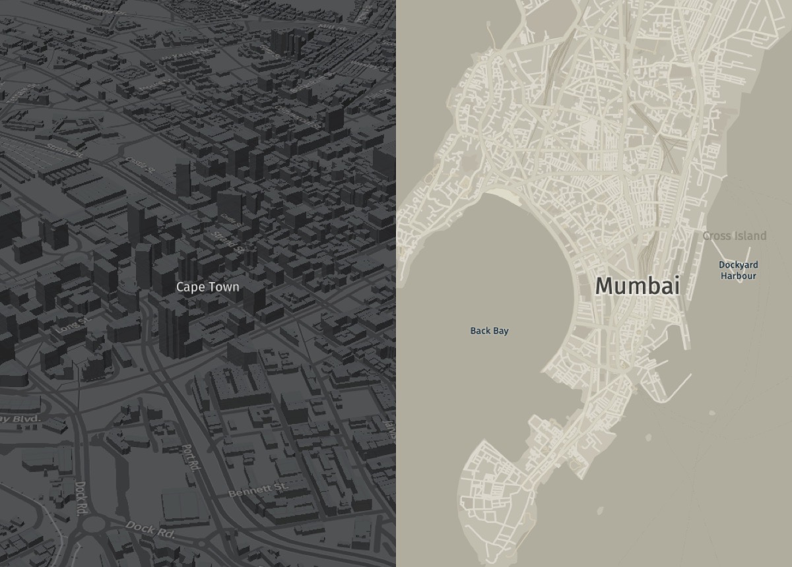

# HERE Vector Tile Examples

This repository contains working examples of the HERE Vector Tile Service with various web map renderers.

For more information on the HERE Vector Tile Service, please visit the [official documentation](https://developer.here.com/documentation/vector-tile-api/dev_guide/index.html).



_From left to right: Berlin base (harp.gl), Berlin night (Mapbox GL JS), Berlin day (Tangram JS)._

## Renderers

### harp.gl

* [Live demo](https://heremaps.github.io/vector-tile-examples/harp.gl)
* [Source code](./harp.gl/index.html)
* [Tutorial on getting started with harp.gl](https://developer.here.com/tutorials/harpgl)

### Mapbox GL JS

* [Live demo](https://heremaps.github.io/vector-tile-examples/mapbox)
* [Source code](./mapbox/index.html)
* [Tutorial on integrating vector tiles into Mapbox GL JS](https://developer.here.com/tutorials/vector-tile-mapbox)

### Tangram JS

* [Live demo](https://heremaps.github.io/vector-tile-examples/tangram)
* [Source code](./tangram/index.html)
* [Tutorial on integrating vector tiles into Tangram JS](https://developer.here.com/tutorials/vector-tile-tangram)

## Styles 

The examples with harp.gl, Mapbox GL JS, and Tangram reference style sheets hosted by HERE:

```
https://assets.vector.hereapi.com/styles/berlin/base/mapbox/tilezen?apikey=YOUR-API-KEY
```

This service contains a set of out of the box styles ready to be used with the harp.gl, Mapbox GL JS, and Tangram JS renderers. For more information about this service, please visit the [official documentation](). ADD LINK HERE!


## License

Copyright (C) 2019 HERE Europe B.V.

Licensed under the Apache-2.0 license, see the [LICENSE](./LICENSE) file in the root of this project for license details.